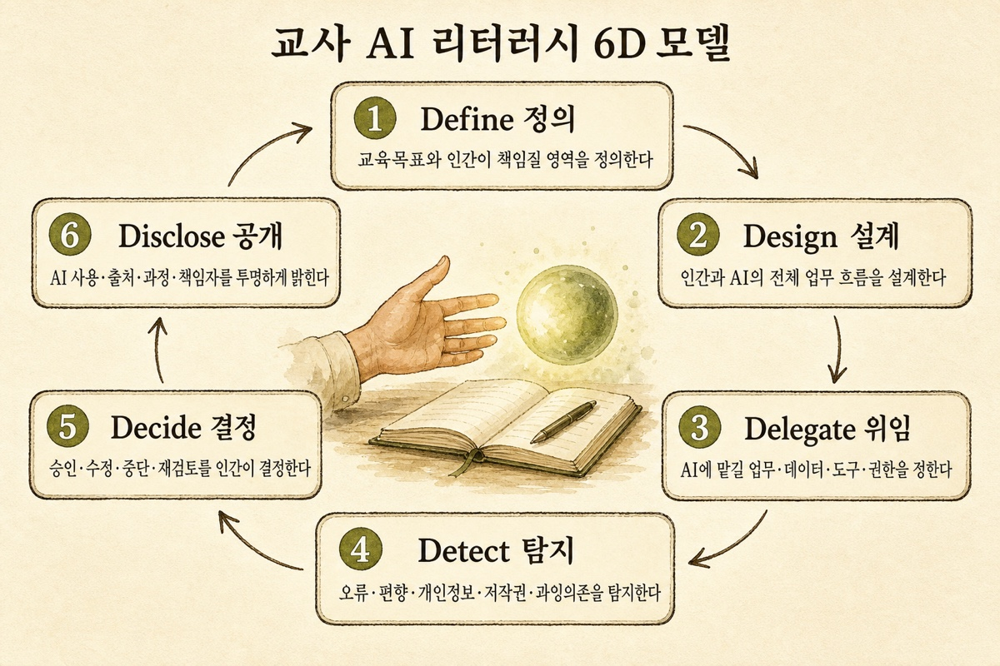

# 위임의 기술 — 6D로 살아남는 한 학기

AI 시대 교사의 핵심 역량인 **6D 모델**을 훈련하는 시뮬레이션 내러티브 웹게임입니다.
설치·로그인·서버 없이, 링크 하나로 누구나 플레이할 수 있는 공개 교구입니다.

**▶ 플레이: https://taehyeonglim.github.io/ai-agent-teacher/**


> 당신은 한별초 5학년 2반 담임교사. 올해, 스스로 행동하는 AI 에이전트 **온새미**가
> 학급에 배정되었다. 3월 개학부터 여름방학까지 — 수업 준비, 첫 평가, 상담 주간,
> 수행평가, 그리고 7월의 사건들. 매 순간 당신이 결정한다.
> **무엇을 위임하고, 어디서 멈추게 하고, 누가 책임질 것인가.**

| 위임의 유혹 | 사건은 돌아온다 |
|---|---|
|  |  |

## 6D 모델 — 무엇을 훈련하나

프롬프트 기술이 아니라 **판단**을 훈련합니다. AI가 행동 권한을 갖는 시대에
교사에게 필요한 것은 "AI를 얼마나 쓰는가"가 아니라 "인간 통제의 질"이라는 관점입니다.



> 강의·연수 자료에 figure로 활용하실 수 있습니다 — 고해상도 원본: [img/6d-model.png](img/6d-model.png) (출처 표기와 함께 자유 사용)

| 단계 | 정의 |
|---|---|
| **Define** 정의 | 교육목표와 인간이 책임질 영역을 정의한다 |
| **Design** 설계 | 인간과 AI의 전체 업무 흐름을 설계한다 |
| **Delegate** 위임 | AI에 맡길 업무·데이터·도구·권한을 정한다 |
| **Detect** 탐지 | 오류·편향·개인정보·저작권·과잉의존을 탐지한다 |
| **Decide** 결정 | 승인·수정·중단·재검토를 인간이 결정한다 |
| **Disclose** 공개 | AI 사용·출처·과정·책임자를 투명하게 밝힌다 |

> 6D 모델: UNESCO(2024)·EU AI Act 제4조·OECD를 종합한 임태형(전주교육대학교)의
> 재구성 실천 모델 (공인 프레임워크 아님)

## 게임 구조

- **5챕터 + 에필로그** · 결정 17~19회 · 1회 플레이 약 20분 · 전 장면 삽화 67컷

| 챕터 | 시기 | 업무 | 핵심 훈련 |
|---|---|---|---|
| 1. 새 학기 | 3월 | 수업 준비 | Define, Delegate |
| 2. 첫 평가 | 4월 | 개별 피드백 | Design, Detect |
| 3. 상담 주간 | 5월 | 학부모 소통 | Delegate, Decide |
| 4. 수행평가 | 6월 | 평가와 공개 | Decide, Disclose |
| 5. 사건 | 7월 | 위기 대응 | 6D 종합 |

**설계 원칙**
- 게임 중에는 점수가 절대 보이지 않습니다 — 선택의 결과는 서사(학부모 민원, 학생의 변화, 동료의 질문)로만 돌아옵니다.
- 모든 결정은 "잘 설계된 위임 / 무분별한 위임 / 과잉 회피"의 스펙트럼입니다. **AI를 안 쓰는 것도 공짜가 아닙니다** — 회피에는 피로가 쌓입니다.
- 1~4챕터의 선택이 남긴 흔적(플래그)이 **7월의 사건 6종**으로 발화합니다. 레드팀 질문 6가지(오정보 확신 사용, 데이터 외부 잔존, 권한 초과 실행, 학부모 이의 제기, 사용 미공개, 과정 설명 불가)를 사건으로 극화했습니다. 잘 설계한 플레이어에게는 사건 대신 "준비의 흔적"이 돌아옵니다.

## 엔딩과 학습 루프

- **6D 레이더 프로파일** + 축별 점수, 최저 2개 축에 대한 **맞춤 처방과 30일 실천 문장**
- **플레이 스타일 칭호 6종**: 신중한 오케스트레이터 · 고독한 장인 · 브레이크 없는 위임러 · 그림자 속 혁신가 · 믿음의 항해사 · 성장하는 설계자 — 칭호 도감(N/6)으로 재플레이를 유도합니다
- **복기하기**: 한 학기의 모든 결정을 되짚습니다. 아쉬운 결정에는 영향받은 축과 "그때의 다른 선택지"가, 위험한 위임에는 "이 선택의 흔적은 7월의 사건으로 이어졌습니다"가 표시됩니다
- **결과 공유**: 결과 카드 PNG 저장, 결과 링크 복사 — 링크는 서버 없이 결과 화면을 재현하며, 소셜 공유 시 칭호별 썸네일 카드가 표시됩니다

## 연수·수업 활용 팁

1. **개인 플레이(20분)** → 결과 링크를 채팅방에 모아 서로 비교
2. **복기 화면**을 짝과 함께 보며 "가장 오래 고민한 결정" 이야기 나누기
3. 6D 캔버스로 자기 업무 하나(수업 준비·피드백·가정통신)를 직접 설계해 보기
4. 재플레이로 다른 칭호에 도달해 보기 — "브레이크 없는 위임러"를 일부러 겪어 보는 것도 훈련입니다

## 기술 구조

순수 정적 웹 — 프레임워크·빌드 도구·서버·API 키가 전부 없습니다. `index.html`을 파일로 열어도 동작합니다.

```
├── index.html            # 셸 (OG 메타·오류 화면·스크립트 로드)
├── css/game.css          # 종이 노트 무드 (강의 덱 디자인 토큰 계승)
├── js/
│   ├── engine.js         # 장면 전이·분기·플래그·localStorage 이어하기
│   ├── scoring.js        # 6D 누적·정규화·레이더 SVG·칭호 판정
│   ├── review.js         # 복기 데이터 생성
│   ├── bootstrap.js      # DOM 렌더링 (엔진은 DOM을 모름)
│   └── data/             # ★ 콘텐츠는 전부 여기 — 엔진과 완전 분리
│       ├── schema.md     #   시나리오 데이터 계약서
│       ├── chapter1~5.js #   장면·선택지·가중치·플래그
│       ├── endings.js    #   처방·칭호·에필로그·축별 만점
│       └── art.js        #   장면→삽화 매핑
├── share/                # 칭호별 소셜 공유 페이지 (OG 썸네일 + 리다이렉트)
├── tools/                # 검증기·테스트·밸런스 시뮬레이터
└── docs/                 # 설계서·구현 계획·시나리오 팩 가이드
```

- 저장: `localStorage`만 사용 (이어하기·칭호 도감). 외부 전송 데이터 없음.
- 이미지: WebP(총 5.1MB) + JPEG 폴백, 다음 장면 프리페치.
- 접근성: 화면 전환 포커스 이동, 레이더 차트의 텍스트 점수 목록, 44px+ 터치 타깃.

## 검증 파이프라인

콘텐츠(시나리오)와 코드가 분리되어 있어, 각각을 기계적으로 검증합니다.
GitHub Actions가 push마다 아래를 자동 실행합니다.

| 명령 | 검사 내용 |
|---|---|
| `node tools/validate.js` | 참조 무결성·도달성·가중치 범위·플래그 정합성·사건 게이트·축별 결정 수 |
| `node --test tools/*.test.js` | 엔진·점수·복기·검증기 로직 테스트 49개 |
| `node tools/playthrough.js` | 모범/남용/회피 3전략이 의도한 칭호에 도달하는지 (결정적) |
| `node tools/montecarlo.js` | 무작위 1,000회 — 칭호 분포·사건 발화율 밸런스 (로컬 전용) |

새 시나리오 팩(중등·관리자·예비교사 등) 제작 절차는
**[docs/scenario-pack-guide.md](docs/scenario-pack-guide.md)** 를 참고하세요.
js/css 수정 배포 시에는 `index.html`의 `?v=N`을 1 올립니다 (캐시버스팅).

## 제작 방식

이 게임 자체가 6D의 실천 사례로 만들어졌습니다 — 사람(총괄)이 목표와 경계를 정의하고,
AI들에게 위임하고, 계약(스키마·테스트)으로 탐지하고, 결과를 사람이 결정했습니다.

- **기획·검수**: Claude Fable 5 — 스키마·챕터 브리프·수락 테스트 작성, 통합·밸런스 검증
- **구현·집필**: Codex GPT-5.6-Terra 병렬 외주 — 엔진·검증기·챕터 5편 동시 집필
- **삽화 73컷**: gpt-image — 시리즈 스타일 잠금 프롬프트로 일관성 유지
- **총괄**: 임태형 (전주교육대학교)

원천 콘텐츠는 교사 특강 「교사를 위한 AI 리터러시 — 생성하는 AI에서 행동하는 AI로」의
6D 모델·사례·레드팀 질문입니다.

## 라이선스

[MIT](LICENSE) — 자유롭게 활용하시되, 6D 모델 출처 표기는 유지해 주세요.

문의: 임태형 · thlim@jnue.kr
